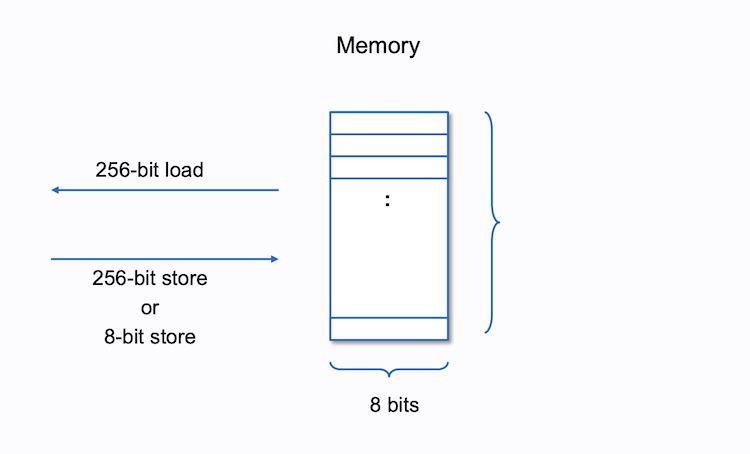
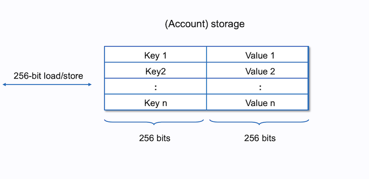

- EVM is a Virtual Machine responsible for executing Ethereum bytecode.
- Ethereum is “special” because it is universal or Turing complete. Which means that any arbitrary program can be run on the EVM (we ignore gas and memory restrictions).
- STACK => MEMORY => STORAGE
- A stack of plates is a good metaphor. You can add a plate or remove a plate from the top. A stack works in the same way.
- The EVM stack has a maximum capacity of 1024 items. Every item on the stack is at max a 256-bit value (32 bytes). `MAXIMUM_STACK_SIZE = 1024`
- The Stack is part of the volatile machine state of the EVM, so its operations are only persistent during transaction execution
- A common error developers run into when dealing with the Stack is stack overflow/underflow and not enough gas. This occurs when there is an exception on the Stack due to an incorrect amount of items on the Stack or insufficient gas to complete the computation.
- 
- 
- Memory on the EVM is linear and volatile, meaning that this data is not persistent across transactions, only during a transaction's runtime. While the costs to store memory during runtime increase quadratically with size, it is still cheaper to use than Storage, which persists in its state
- 
- In the EVM, the memory holds an unlimited number of cells, each cell holding 1 byte, while the reading and writing of instruction/data is done using 32-bytes(a word) chunk at a time.
- Only 3 things ever happen with memory:
  - store
  - load
  - access
- The storage is a mapping from a key to a value of 256-bit to 256-bit. The number of keys is for all practical purposes infinite. The value can be up to 32 bytes. Every value is initialized with a 0. This is like the SSD in your computer. Storage is non-volatile.
- 
- The maximum contract size that can be deployed (stored) on Ethereum is 24,576 bytes (24KB); however, this should not be confused with the limit of data that you can store on the smart contract (which is only limited by gas, not size).
- A slot is said to be warm if it was accessed before. Otherwise it is cold. Accessing a slot that is cold costs more gas than accessing a warm slot.
- A specific opcode is an operation that manipulates the EVM state.
- The program counter points to the next opcode that the EVM is going to execute
- Stack / Memory / Storage are part of the EVM state. And are the areas where the EVM manipulates and stores data.
- Program is where we store the bytecode of the current program. It can not change during execution, which makes it immutable.
- The `stop_flag` and `revert_flag`. If one of them is True, the current execution is going to stop.
- All opcodes have one thing in common. They manipulate the current state of the EVM.
